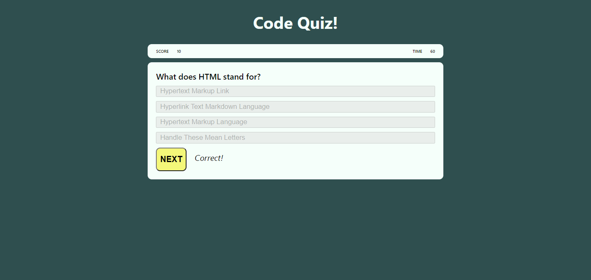

# Code-Quiz README

Use JavaScript to create a quiz that tests the user on their code knowledge.

## Table of Contents
[Description](#description)

[Features](#features)

[Usage](#usage)

[Credits](#credits)

---

## Description

Take a timed quiz on coding fundamentals that stores high scores so that I can gauge my progress compared to my peers

* Start the quiz
* Answer the multiple choice questions before the time runs out
* Once finished submit your name to save your score
* Checkout the other users scores to compare how you did

---

## Features

* Instructions for quiz

* Different visible sections that show and hide in the main container for the pre-quiz, quiz, after-quiz, and high score sections

* Click-able "Start" button

* Click-able "Choice" buttons

* Feedback immediately if your choice is the correct answer

* Click-able "Next" button that appears after your choice

* Click-able "Finish" button

* Score counter

* Time counter

* Input field to save your name

* Click-able "Submit" button to save "Name" and save "Score" to local storage

* Click-able "High Score" button to view previous user high scores pulled from local storage

---

## Usage

* Click the start button to start the quiz

* Once the start button is clicked the timer starts

    * You have 60 seconds to finish the quiz

* Click a choice before being able to proceed to the next question

    * Once you choose an answer the quiz notifies you if you are correct or wrong

    * For every question you answer right 10 points are added to your score

    * For every question you answer wrong 10 seconds is subtracted from your remaining time

* Once you have answered all the questions and click the finish button, or run out of time, the quiz is done

    * Type in your name and click the submit button to save your score

* Click the high score button to view all the high scores

---

## Credits

Special thanks to Josh and the gang for their help!

Also thanks to my sister for helping me think through the some of logic when my brain turned to soup!

https://www.w3schools.com/

https://stackoverflow.com/questions/17087636/how-to-save-data-from-a-form-with-html5-local-storage

https://www.youtube.com/watch?v=riDzcEQbX6k

https://www.youtube.com/watch?v=LQGTb112N_c